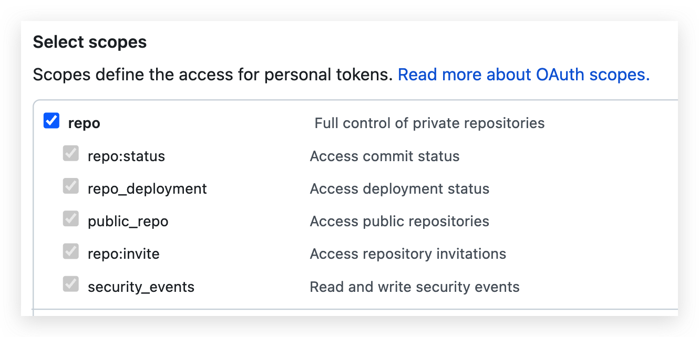

# Screenshot Handler

It provides a set of image-handling tools to handle screenshot from clipboard.

## Avaliable handlers

- Upload to image host
- OCR
- Base64
- Copy to path
- Image search (TODO)
- Add invisible watermark to image (TODO)

## Install

a. Install with `go`

```bash
go install github.com/Mopip77/screenshot-handler
```

b. Or you can just download bin from Release page.

---

Then set a short alias for `screenshot-handler`

```bash
echo "alias sch=screenshot-handler" >> ~/.bashrc
```

## Usage

See `sch --help` for more information, the default config file `~/.schrc.yaml` will be generated when first run.

**First of all**, take a screenshot then copy it to clipboard.

### Upload to image host

1. Set an auth token for image host, and choose which to use in configuration.

    ```yaml
    # upload to image host settings
    upload:
    use:  # support multiple host
      - smms
      - github
    smms_token:
    github:
        username: # github username
        repo:     # image host repo
        token:    # github token with repo permission
    ```

    You can generate token from: [SMMS](https://sm.ms/home/apitoken), [Github](https://github.com/settings/tokens)

    **Reminder**: the `repo` scope permission is required when creating `Github` token.

    

2. Run `sch upload` or `sch u` to upload the screenshot to image host.

    ```bash
    $ sch u
    upload image to github success, url: https://cdn.jsdelivr.net/gh/Mopip77/image-host/20220405/120401.png

    Markdown: 
    BBCode  : [IMG]https://cdn.jsdelivr.net/gh/Mopip77/image-host/20220405/120401.png[/IMG]
    HTML    : 

    markdown template saved to clipboard.
    ```

    The screenshot in clipboard will be uploaded to image host. Then the markdown tmeplate will be copied to clipboard.

    **Tips**: github url will be delivered via js delivr CDN by default. You can use `--js-delivr=false` to disable.

    For more args usage, check `sch upload --help`.

### OCR

1. Set token in `~/.schrc.yaml`:

    ```yaml
    # ocr settings
    ocr:
    use: # tencent
    tencent:
        secret_id:
        secret_key:
    ```

    Only `tencent` ocr service avaliable now. [Get Tencent OCR Token](https://cloud.tencent.com/product/ocr-catalog)

2. Then run `sch o`

### Others

Check other command usages by `sch --help`.

## Screenshot Source

### 1. Clipboard *(default)*

For convenience, `sch` will get screenshot from clipboard by default.

### 2. Screenshot Folder

But you can also specify the screenshot folder in `~/.schrc.yaml`:

```yaml
# default screenshot folder
screenshot_folder: <change-to-your-screenshot-folder>
```

Then run with `-d` or `--dir` global flag to get newest screenshot in the folder.

```bash
sch -d <command>
```

### 3. Specific Filepath

use `--file` option to specify the screenshot filepath.

```bash
sch --file=~/a.png <command>
```